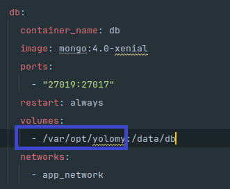

## Requirements

Make sure that you have the following installed and correctly configured:

- [docker](https://docs.docker.com/engine/install/)
- [docker compose](https://docs.docker.com/compose/install/)

## Installation instructions

1. Clone the code repository.
2. Create a .env file in the root folder. Export two variable; client_tag (`export client_tag=<tag-name>`) and api-tag  (`export api_tag=<tag-name>`). The tag versions can be automatically generated by other CD tools.
3. Create a folder anywhere on the host machine and give it correct permissions. This folder will persist db data.
4. Copy the path and attach it on the volumes key in the db service within the docker compose file.

    
## Running the microservice

1. `cd yolo` : Navigate into root folder.
2. `docker compose build --no-cache` : Build docker images.
3. `docker compose up -d` : Start docker containers in detached mode.

## Interacting with the application

- Open your favourite browser and type in `http://localhost:3000`.
- Go ahead and add a product (note that the price field only takes a numeric input). You should also view all added products.